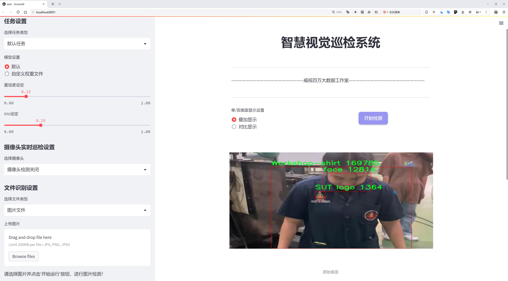
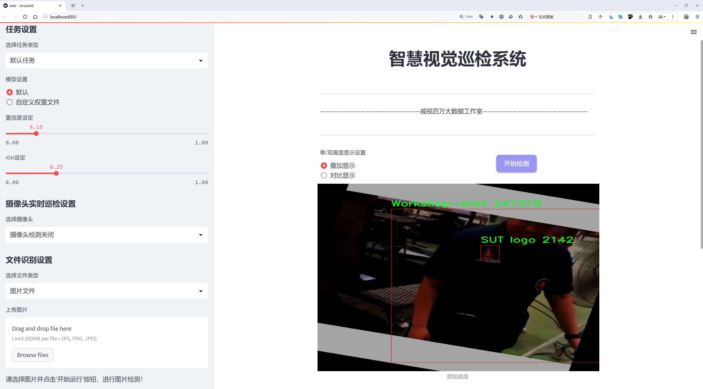
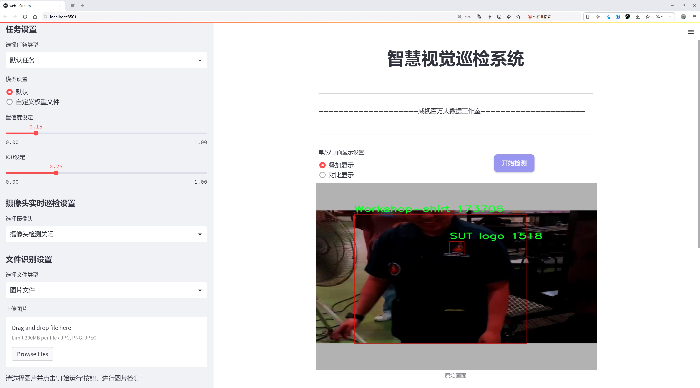
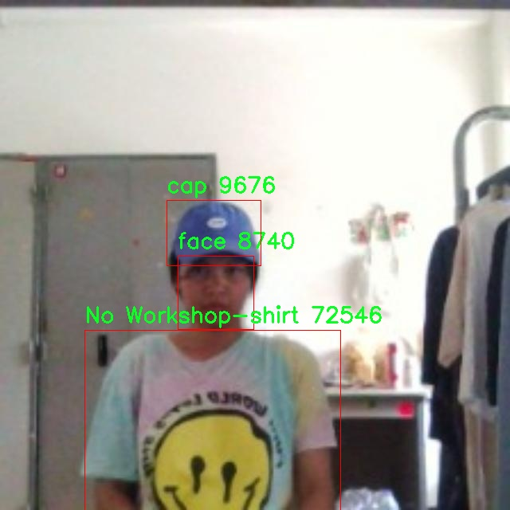
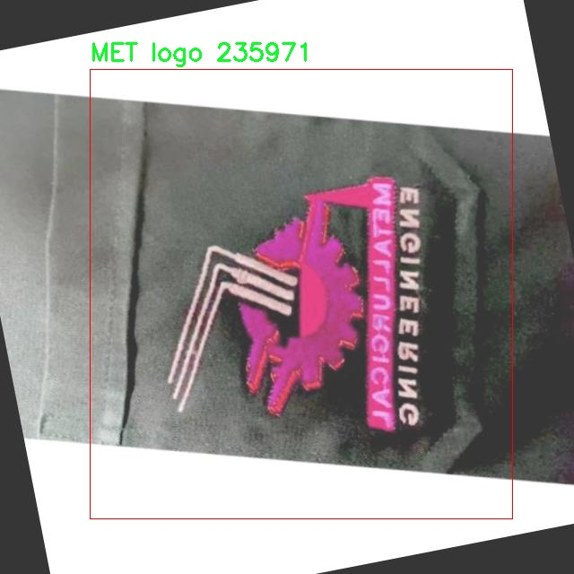
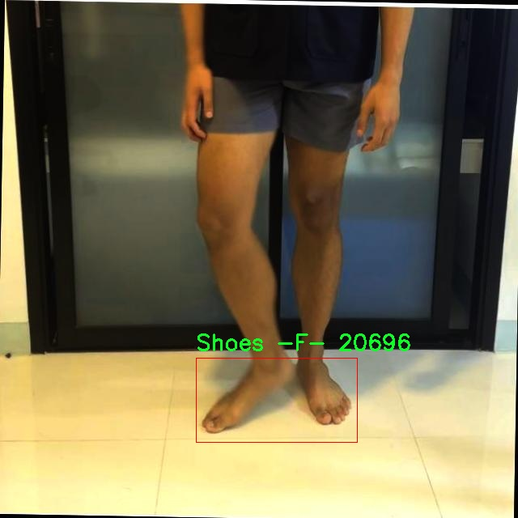
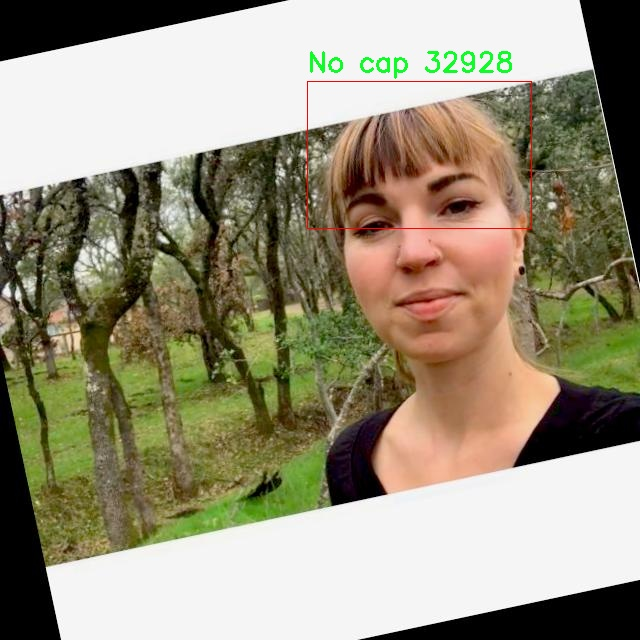
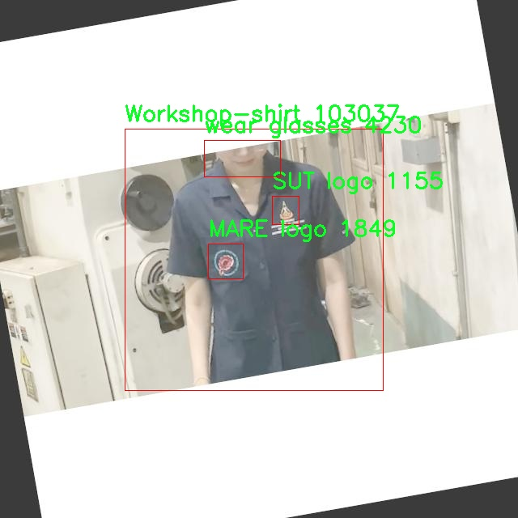

# 服装与配饰识别检测系统源码分享
 # [一条龙教学YOLOV8标注好的数据集一键训练_70+全套改进创新点发刊_Web前端展示]

### 1.研究背景与意义

项目参考[AAAI Association for the Advancement of Artificial Intelligence](https://gitee.com/qunshansj/projects)

项目来源[AACV Association for the Advancement of Computer Vision](https://gitee.com/qunmasj/projects)

研究背景与意义

随着信息技术的迅猛发展，计算机视觉在各个领域的应用日益广泛，尤其是在物体检测和识别方面。近年来，深度学习技术的突破使得图像识别的准确性和效率得到了显著提升。在众多的物体检测算法中，YOLO（You Only Look Once）系列模型因其实时性和高效性而受到广泛关注。YOLOv8作为该系列的最新版本，进一步优化了检测精度和速度，适用于多种复杂场景的物体识别任务。然而，尽管YOLOv8在一般物体检测上表现出色，但在特定领域，如服装与配饰的识别上，仍存在一定的挑战。

服装与配饰的识别不仅涉及到多样化的物品类别，还需要考虑不同的颜色、款式、材质等因素，这使得该领域的物体检测任务更加复杂。针对这一需求，构建一个基于改进YOLOv8的服装与配饰识别系统显得尤为重要。该系统将能够高效地识别和分类不同类型的服装和配饰，为时尚行业、电子商务平台以及智能零售等领域提供强有力的技术支持。

本研究所使用的数据集包含8900张图像，涵盖14个类别，包括不同品牌的标志、各种类型的服装（如工作衫、短裤、牛仔裤等）以及配饰（如帽子、鞋子、眼镜等）。这些类别的多样性不仅为模型的训练提供了丰富的样本，也为后续的模型评估和优化提供了基础。通过对这些图像的深入分析和处理，研究将能够挖掘出服装与配饰识别中的潜在规律，从而提升模型的识别精度。

在当前的市场环境中，消费者对个性化和多样化的需求日益增加，传统的零售模式面临着巨大的挑战。基于改进YOLOv8的服装与配饰识别系统能够为商家提供实时的市场反馈，帮助其更好地了解消费者的偏好和需求，从而优化产品设计和库存管理。此外，该系统还可以为消费者提供个性化的推荐服务，提升购物体验，推动在线购物的普及。

综上所述，基于改进YOLOv8的服装与配饰识别系统的研究，不仅具有重要的学术价值，也具有广泛的应用前景。通过对物体检测技术的深入探索和应用，研究将为时尚行业的数字化转型提供新的思路和方法，推动智能零售的发展。随着研究的深入，期望能够为相关领域的研究者和从业者提供有价值的参考和借鉴，助力服装与配饰识别技术的不断进步与创新。

### 2.图片演示







##### 注意：由于此博客编辑较早，上面“2.图片演示”和“3.视频演示”展示的系统图片或者视频可能为老版本，新版本在老版本的基础上升级如下：（实际效果以升级的新版本为准）

  （1）适配了YOLOV8的“目标检测”模型和“实例分割”模型，通过加载相应的权重（.pt）文件即可自适应加载模型。

  （2）支持“图片识别”、“视频识别”、“摄像头实时识别”三种识别模式。

  （3）支持“图片识别”、“视频识别”、“摄像头实时识别”三种识别结果保存导出，解决手动导出（容易卡顿出现爆内存）存在的问题，识别完自动保存结果并导出到tempDir中。

  （4）支持Web前端系统中的标题、背景图等自定义修改，后面提供修改教程。

  另外本项目提供训练的数据集和训练教程,暂不提供权重文件（best.pt）,需要您按照教程进行训练后实现图片演示和Web前端界面演示的效果。

### 3.视频演示

[3.1 视频演示](https://www.bilibili.com/video/BV1Uy4deeE27/)

### 4.数据集信息展示

##### 4.1 本项目数据集详细数据（类别数＆类别名）

nc: 14
names: ['IE logo', 'MARE logo', 'MET logo', 'No Workshop-shirt', 'No cap', 'SUT logo', 'Shoes -F-', 'Shoes -T-', 'Workshop-shirt', 'cap', 'face', 'shorty', 'wear glasses', 'wear jeanse']


##### 4.2 本项目数据集信息介绍

数据集信息展示

在本研究中，我们使用了名为“Final”的数据集，以训练和改进YOLOv8模型在服装与配饰识别任务中的表现。该数据集的设计旨在涵盖多样化的服装和配饰类别，以便为模型提供丰富的训练样本，从而提高其在实际应用中的准确性和鲁棒性。数据集包含14个类别，具体包括：IE logo、MARE logo、MET logo、No Workshop-shirt、No cap、SUT logo、Shoes -F-、Shoes -T-、Workshop-shirt、cap、face、shorty、wear glasses和wear jeanse。这些类别不仅涵盖了不同类型的服装和配饰，还包括了一些特定的标志和配件，使得模型能够在多种场景下进行有效的识别。

在数据集的构建过程中，我们特别关注了样本的多样性和代表性。每个类别的样本均来自于不同的环境和背景，以确保模型在面对各种实际情况时能够保持良好的识别能力。例如，IE logo、MARE logo和MET logo等类别的样本均包含了不同的品牌标志，这不仅有助于模型学习到品牌识别的特征，也能提升其在实际应用中的商业价值。同时，No Workshop-shirt和No cap等类别的设计，旨在帮助模型识别缺失的服装或配饰，从而增强其在复杂场景下的适应能力。

此外，数据集中还包含了多种类型的鞋子（Shoes -F-和Shoes -T-），这些样本的多样性使得模型能够学习到不同鞋款的特征，进而提高其在鞋类识别方面的准确性。对于服装类别，如Workshop-shirt、cap和shorty等，样本的选择也考虑到了不同的颜色、款式和材质，以便模型能够更全面地理解和识别这些服装的多样性。

在配饰方面，wear glasses和wear jeanse类别的样本同样经过精心挑选，以确保模型能够有效识别佩戴眼镜和牛仔裤的个体。这些配饰的识别不仅丰富了模型的应用场景，也为其在时尚行业的应用提供了更多可能性。face类别的引入则为模型提供了一个额外的维度，使其能够在识别服装和配饰的同时，关注到个体的面部特征，从而实现更为精准的识别。

通过对“Final”数据集的深入分析和理解，我们相信该数据集将为YOLOv8模型的训练提供强有力的支持。随着模型在这些丰富多样的类别上进行训练，我们期望其在服装与配饰识别任务中的表现能够得到显著提升。最终，我们的目标是构建一个高效、准确的服装与配饰识别系统，以满足日益增长的市场需求和应用场景。











### 5.全套项目环境部署视频教程（零基础手把手教学）

[5.1 环境部署教程链接（零基础手把手教学）](https://www.ixigua.com/7404473917358506534?logTag=c807d0cbc21c0ef59de5)


[5.2 安装Python虚拟环境创建和依赖库安装视频教程链接（零基础手把手教学）](https://www.ixigua.com/7404474678003106304?logTag=1f1041108cd1f708b01a)

### 6.手把手YOLOV8训练视频教程（零基础小白有手就能学会）

[6.1 手把手YOLOV8训练视频教程（零基础小白有手就能学会）](https://www.ixigua.com/7404477157818401292?logTag=d31a2dfd1983c9668658)

### 7.70+种全套YOLOV8创新点代码加载调参视频教程（一键加载写好的改进模型的配置文件）

[7.1 70+种全套YOLOV8创新点代码加载调参视频教程（一键加载写好的改进模型的配置文件）](https://www.ixigua.com/7404478314661806627?logTag=29066f8288e3f4eea3a4)

### 8.70+种全套YOLOV8创新点原理讲解（非科班也可以轻松写刊发刊，V10版本正在科研待更新）

由于篇幅限制，每个创新点的具体原理讲解就不一一展开，具体见下列网址中的创新点对应子项目的技术原理博客网址【Blog】：


[8.1 70+种全套YOLOV8创新点原理讲解链接](https://gitee.com/qunmasj/good)

### 9.系统功能展示（检测对象为举例，实际内容以本项目数据集为准）

图9.1.系统支持检测结果表格显示

  图9.2.系统支持置信度和IOU阈值手动调节

  图9.3.系统支持自定义加载权重文件best.pt(需要你通过步骤5中训练获得)

  图9.4.系统支持摄像头实时识别

  图9.5.系统支持图片识别

  图9.6.系统支持视频识别

  图9.7.系统支持识别结果文件自动保存

  图9.8.系统支持Excel导出检测结果数据


### 10.原始YOLOV8算法原理

原始YOLOv8算法原理

YOLOv8作为YOLO系列的最新版本，延续了YOLO算法一贯的高效性和准确性，同时在结构和功能上进行了多项创新与优化。YOLO（You Only Look Once）系列自2015年首次提出以来，已经历了多个版本的迭代，每一次更新都在不断提升目标检测的性能。YOLOv8在前几代的基础上，进一步增强了模型的推理速度和检测精度，成为了当今目标检测领域的一个重要里程碑。

YOLOv8的网络结构主要由四个部分组成：输入层、Backbone骨干网络、Neck特征融合网络和Head检测模块。输入层负责对输入图像进行预处理，包括调整图像比例、实现Mosaic增强以及瞄点计算等操作，以确保后续特征提取的有效性和准确性。YOLOv8的Backbone采用了改进的DarkNet结构，其中C2f模块替代了传统的C3模块，旨在增强特征提取的能力。C2f模块通过调整不同尺度模型的通道数，优化了梯度流动信息的保留，确保了模型在保持轻量级特性的同时，能够提取到更丰富的特征信息。

在特征融合方面，YOLOv8的Neck部分依然采用“双塔结构”，结合了特征金字塔网络（FPN）和路径聚合网络（PAN），这两者的结合极大地促进了语义特征与定位特征之间的转移与融合。特征金字塔网络通过多尺度特征的融合，能够有效地捕捉到不同尺度目标的特征，而路径聚合网络则进一步增强了特征的传递效率。这种结构的设计使得YOLOv8在面对复杂场景时，能够更好地处理目标的多样性和复杂性，提升了对不同尺度目标的检测性能。

在检测模块中，YOLOv8采用了三个解耦头（Decoupled Head），将回归分支和分类分支进行分离。这一创新设计使得模型在处理分类和定位任务时，能够更加专注于各自的目标，从而有效地解决了在复杂场景下可能出现的定位不准和分类错误的问题。解耦头的引入，不仅加速了模型的收敛速度，还提升了整体的检测精度。

YOLOv8的另一大亮点是其采用的Anchor-free目标检测方法。这种方法不同于传统的目标检测技术，后者通常需要预先定义锚点框来预测目标的位置。锚点框的选择和调整往往繁琐且复杂，且对于不同尺度和形状的目标，可能需要不同的锚点框。而YOLOv8通过直接回归目标的位置和大小，简化了这一过程，使得网络能够更快地聚焦于目标位置的邻近点，从而使得预测框更接近于实际的边界框区域。这种创新不仅提高了检测的效率，也在一定程度上减轻了模型训练时的负担。

在模型设置方面，YOLOv8提供了多种可调参数，如depth_factor、width_factor和ratio，这些参数允许用户根据具体需求灵活调整模型的深度、宽度及通道数。这种灵活性使得YOLOv8能够适应不同的应用场景，无论是在嵌入式设备上还是在高性能计算平台上，都能实现高效的目标检测。

YOLOv8的设计理念不仅关注于模型的性能提升，还注重于其在实际应用中的可用性和适应性。通过对网络结构的优化和参数的灵活设置，YOLOv8能够在各种硬件平台上实现高效的推理，满足实时检测的需求。这使得YOLOv8在自动驾驶、视频监控、无人机监测等多个领域展现出广泛的应用前景。

综上所述，YOLOv8作为YOLO系列的最新版本，凭借其创新的网络结构、灵活的模型设置以及高效的目标检测能力，标志着目标检测技术的一次重要进步。其在精度和速度上的双重提升，使得YOLOv8不仅是学术研究的热点，更是工业界广泛应用的首选模型。随着YOLOv8的不断发展与完善，未来的目标检测技术将更加智能化、精准化，为各行各业的应用提供更为强大的支持。


### 11.项目核心源码讲解（再也不用担心看不懂代码逻辑）

#### 11.1 70+种YOLOv8算法改进源码大全和调试加载训练教程（非必要）\ultralytics\utils\loss.py

以下是对代码中最核心部分的分析和详细注释。代码主要实现了不同类型的损失函数，这些损失函数在目标检测、分割和关键点检测等任务中被广泛使用。

```python
import torch
import torch.nn as nn
import torch.nn.functional as F

class SlideLoss(nn.Module):
    def __init__(self, loss_fcn):
        super(SlideLoss, self).__init__()
        self.loss_fcn = loss_fcn
        self.reduction = loss_fcn.reduction
        self.loss_fcn.reduction = 'none'  # 需要对每个元素应用滑动损失

    def forward(self, pred, true, auto_iou=0.5):
        # 计算基础损失
        loss = self.loss_fcn(pred, true)
        # 确保auto_iou不小于0.2
        if auto_iou < 0.2:
            auto_iou = 0.2
        # 计算调制权重
        b1 = true <= auto_iou - 0.1
        a1 = 1.0
        b2 = (true > (auto_iou - 0.1)) & (true < auto_iou)
        a2 = math.exp(1.0 - auto_iou)
        b3 = true >= auto_iou
        a3 = torch.exp(-(true - 1.0))
        modulating_weight = a1 * b1 + a2 * b2 + a3 * b3
        loss *= modulating_weight  # 应用调制权重
        # 根据reduction类型返回损失
        if self.reduction == 'mean':
            return loss.mean()
        elif self.reduction == 'sum':
            return loss.sum()
        else:  # 'none'
            return loss

class BboxLoss(nn.Module):
    def __init__(self, reg_max, use_dfl=False):
        super().__init__()
        self.reg_max = reg_max  # 最大回归值
        self.use_dfl = use_dfl  # 是否使用分布焦点损失
        self.iou_ratio = 0.5  # IoU比率

    def forward(self, pred_dist, pred_bboxes, anchor_points, target_bboxes, target_scores, target_scores_sum, fg_mask):
        # 计算IoU损失
        weight = target_scores.sum(-1)[fg_mask].unsqueeze(-1)  # 计算权重
        iou = bbox_iou(pred_bboxes[fg_mask], target_bboxes[fg_mask], xywh=False, CIoU=True)  # 计算IoU
        loss_iou = ((1.0 - iou) * weight).sum() / target_scores_sum  # IoU损失

        # DFL损失
        if self.use_dfl:
            target_ltrb = bbox2dist(anchor_points, target_bboxes, self.reg_max)  # 将目标框转换为分布
            loss_dfl = self._df_loss(pred_dist[fg_mask].view(-1, self.reg_max + 1), target_ltrb[fg_mask]) * weight
            loss_dfl = loss_dfl.sum() / target_scores_sum
        else:
            loss_dfl = torch.tensor(0.0).to(pred_dist.device)

        return loss_iou, loss_dfl  # 返回IoU损失和DFL损失

    @staticmethod
    def _df_loss(pred_dist, target):
        # 计算分布焦点损失
        tl = target.long()  # 左边界
        tr = tl + 1  # 右边界
        wl = tr - target  # 左权重
        wr = 1 - wl  # 右权重
        return (F.cross_entropy(pred_dist, tl.view(-1), reduction='none').view(tl.shape) * wl +
                F.cross_entropy(pred_dist, tr.view(-1), reduction='none').view(tl.shape) * wr).mean(-1, keepdim=True)

class v8DetectionLoss:
    def __init__(self, model):
        device = next(model.parameters()).device  # 获取模型设备
        m = model.model[-1]  # 获取检测模块
        self.bce = nn.BCEWithLogitsLoss(reduction='none')  # 二元交叉熵损失
        self.bbox_loss = BboxLoss(m.reg_max - 1, use_dfl=m.reg_max > 1).to(device)  # 边界框损失

    def __call__(self, preds, batch):
        loss = torch.zeros(3, device=self.device)  # 初始化损失
        pred_distri, pred_scores = self._get_predictions(preds)  # 获取预测分布和分数

        # 处理目标
        targets = self._process_targets(batch)
        gt_labels, gt_bboxes = targets.split((1, 4), 2)  # 分离标签和边界框
        mask_gt = gt_bboxes.sum(2, keepdim=True).gt_(0)  # 生成目标掩码

        # 计算损失
        loss[1] = self.bce(pred_scores, target_scores.to(dtype)).sum() / target_scores_sum  # 类别损失
        if fg_mask.sum():
            loss[0], loss[2] = self.bbox_loss(pred_distri, pred_bboxes, anchor_points, target_bboxes, target_scores, target_scores_sum, fg_mask)  # 边界框损失

        return loss.sum() * batch_size, loss.detach()  # 返回总损失和分离的损失

    def _get_predictions(self, preds):
        # 获取预测分布和分数
        feats = preds[1] if isinstance(preds, tuple) else preds
        pred_distri, pred_scores = torch.cat([xi.view(feats[0].shape[0], self.no, -1) for xi in feats], 2).split((self.reg_max * 4, self.nc), 1)
        return pred_distri.permute(0, 2, 1).contiguous(), pred_scores.permute(0, 2, 1).contiguous()

    def _process_targets(self, batch):
        # 处理目标数据
        targets = torch.cat((batch['batch_idx'].view(-1, 1), batch['cls'].view(-1, 1), batch['bboxes']), 1)
        return self.preprocess(targets.to(self.device), batch_size, scale_tensor=imgsz[[1, 0, 1, 0]])

```

### 代码核心部分分析
1. **SlideLoss**: 该类实现了一种滑动损失函数，通过动态调整损失的权重来提高模型的学习能力。
2. **BboxLoss**: 该类实现了边界框损失，包括IoU损失和可选的分布焦点损失（DFL），用于提高边界框的回归精度。
3. **v8DetectionLoss**: 该类整合了目标检测的损失计算，包括类别损失和边界框损失。它负责处理输入的预测和目标，并计算总损失。

### 总结
这些损失函数是目标检测和分割任务中至关重要的组成部分。通过对损失的设计和实现，可以有效地提高模型的性能和准确性。

这个文件包含了YOLOv8模型中用于计算损失的各种类和方法，主要是针对目标检测、分割和姿态估计等任务的损失函数实现。首先，文件引入了必要的PyTorch库以及一些自定义的工具函数和模块。

文件中定义了多个损失类，每个类负责计算特定类型的损失。`SlideLoss`和`EMASlideLoss`类实现了滑动损失的计算，这种损失函数通过动态调整权重来增强模型对不同IoU（Intersection over Union）阈值的敏感性。`VarifocalLoss`和`FocalLoss`类则实现了变焦损失和焦点损失，这些损失函数旨在处理类别不平衡问题，通过调整难易样本的权重来提升模型的学习效果。

`BboxLoss`类负责计算边界框的损失，包括IoU损失和分布焦点损失（DFL）。该类支持多种IoU计算方式，并可以选择是否使用DFL来增强边界框的回归效果。`KeypointLoss`类用于计算关键点的损失，主要是通过计算预测关键点与真实关键点之间的欧几里得距离来实现。

`v8DetectionLoss`类是一个综合性的损失计算类，负责整合目标检测任务中的所有损失，包括边界框损失、分类损失和DFL损失。它在初始化时接收模型参数，并根据模型的不同设置（如是否使用DFL）来配置损失计算的方式。该类的`__call__`方法会根据输入的预测结果和真实标签计算总损失，并返回损失值。

此外，`v8SegmentationLoss`和`v8PoseLoss`类分别用于计算分割任务和姿态估计任务的损失，继承自`v8DetectionLoss`类，并在此基础上增加了特定于各自任务的损失计算逻辑。`v8ClassificationLoss`类则是一个简单的分类损失计算类，使用交叉熵损失来评估分类任务的性能。

整体来看，这个文件为YOLOv8模型提供了丰富的损失函数实现，能够适应不同的任务需求，并通过灵活的损失计算方式来提升模型的训练效果。

#### 11.2 ui.py

以下是保留的核心代码部分，并附上详细的中文注释：

```python
import sys
import subprocess

def run_script(script_path):
    """
    使用当前 Python 环境运行指定的脚本。

    Args:
        script_path (str): 要运行的脚本路径

    Returns:
        None
    """
    # 获取当前 Python 解释器的路径
    python_path = sys.executable

    # 构建运行命令，使用 streamlit 运行指定的脚本
    command = f'"{python_path}" -m streamlit run "{script_path}"'

    # 执行命令
    result = subprocess.run(command, shell=True)
    # 检查命令执行结果，如果返回码不为0，表示出错
    if result.returncode != 0:
        print("脚本运行出错。")

# 实例化并运行应用
if __name__ == "__main__":
    # 指定要运行的脚本路径
    script_path = "web.py"  # 这里可以直接指定脚本名，假设在当前目录下

    # 调用函数运行脚本
    run_script(script_path)
```

### 代码注释说明：
1. **导入模块**：
   - `sys`：用于访问与 Python 解释器相关的变量和函数。
   - `subprocess`：用于创建新进程、连接到它们的输入/输出/错误管道，并获得它们的返回码。

2. **定义 `run_script` 函数**：
   - 此函数接受一个参数 `script_path`，表示要运行的 Python 脚本的路径。
   - 函数内部首先获取当前 Python 解释器的路径，以便后续使用。

3. **构建命令**：
   - 使用 f-string 格式化字符串，构建一个命令行指令，调用 `streamlit` 模块来运行指定的脚本。

4. **执行命令**：
   - 使用 `subprocess.run` 执行构建的命令，并通过 `shell=True` 允许在 shell 中执行。
   - 检查命令的返回码，如果不为0，表示脚本运行出错，打印错误信息。

5. **主程序入口**：
   - 使用 `if __name__ == "__main__":` 确保该部分代码仅在直接运行脚本时执行。
   - 指定要运行的脚本路径，并调用 `run_script` 函数执行该脚本。

这个程序文件的主要功能是通过当前的 Python 环境来运行一个指定的脚本，具体是使用 Streamlit 框架来启动一个 Web 应用。首先，程序导入了必要的模块，包括 `sys`、`os` 和 `subprocess`，这些模块分别用于获取系统信息、处理文件路径和执行外部命令。

在 `run_script` 函数中，首先获取当前 Python 解释器的路径，这样可以确保使用正确的 Python 环境来运行脚本。接着，构建一个命令字符串，该命令使用 `streamlit run` 来启动指定的脚本。这个命令被传递给 `subprocess.run` 方法，后者负责在新的进程中执行这个命令。

如果脚本运行过程中出现错误，`result.returncode` 将不等于 0，程序会打印出“脚本运行出错”的提示，帮助用户识别问题。

在文件的最后部分，使用 `if __name__ == "__main__":` 语句来确保只有在直接运行该文件时才会执行后面的代码。这部分代码指定了要运行的脚本路径，这里使用了 `abs_path` 函数来获取 `web.py` 文件的绝对路径。最后，调用 `run_script` 函数来启动这个脚本。

总体来说，这个程序是一个简单的脚本启动器，旨在方便地通过 Streamlit 启动 Web 应用。

#### 11.3 70+种YOLOv8算法改进源码大全和调试加载训练教程（非必要）\ultralytics\engine\model.py

以下是代码中最核心的部分，并附上详细的中文注释：

```python
import torch
from pathlib import Path
from typing import Union
from ultralytics.nn.tasks import nn
from ultralytics.utils import LOGGER, checks

class Model(nn.Module):
    """
    统一所有模型API的基类。

    参数:
        model (str, Path): 要加载或创建的模型文件路径。
        task (Any, optional): YOLO模型的任务类型。默认为None。
    """

    def __init__(self, model: Union[str, Path] = 'yolov8n.pt', task=None) -> None:
        """
        初始化YOLO模型。

        参数:
            model (Union[str, Path], optional): 要加载或创建的模型路径或名称。默认为'yolov8n.pt'。
            task (Any, optional): YOLO模型的任务类型。默认为None。
        """
        super().__init__()
        self.model = None  # 模型对象
        self.task = task  # 任务类型
        model = str(model).strip()  # 去除空格

        # 检查是否为Ultralytics HUB模型
        if self.is_hub_model(model):
            from ultralytics.hub.session import HUBTrainingSession
            self.session = HUBTrainingSession(model)
            model = self.session.model_file

        # 加载或创建新的YOLO模型
        suffix = Path(model).suffix
        if suffix in ('.yaml', '.yml'):
            self._new(model, task)  # 从配置文件创建新模型
        else:
            self._load(model, task)  # 从权重文件加载模型

    def _new(self, cfg: str, task=None):
        """
        初始化新模型并从模型定义推断任务类型。

        参数:
            cfg (str): 模型配置文件
            task (str | None): 模型任务
        """
        cfg_dict = yaml_model_load(cfg)  # 加载yaml配置
        self.cfg = cfg
        self.task = task or guess_model_task(cfg_dict)  # 推断任务类型
        self.model = self._smart_load('model')(cfg_dict)  # 创建模型

    def _load(self, weights: str, task=None):
        """
        从权重文件加载模型并推断任务类型。

        参数:
            weights (str): 要加载的模型检查点
            task (str | None): 模型任务
        """
        self.model, self.ckpt = attempt_load_one_weight(weights)  # 加载权重
        self.task = self.model.args['task']  # 获取任务类型

    def predict(self, source=None, stream=False, **kwargs):
        """
        使用YOLO模型进行预测。

        参数:
            source (str | int | PIL | np.ndarray): 要进行预测的图像源。
            stream (bool): 是否流式传输预测结果。默认为False。

        返回:
            (List[ultralytics.engine.results.Results]): 预测结果。
        """
        if source is None:
            LOGGER.warning("WARNING ⚠️ 'source' is missing. Using default source.")
            source = ASSETS  # 默认源

        # 进行预测
        return self.predictor(source=source, stream=stream)

    def is_hub_model(self, model):
        """检查提供的模型是否为HUB模型。"""
        return model.startswith('https://hub.ultralytics.com/models/')

    def _smart_load(self, key):
        """加载模型/训练器/验证器/预测器。"""
        try:
            return self.task_map[self.task][key]
        except Exception as e:
            raise NotImplementedError(f"模型不支持此任务的'{key}'模式。") from e

    @property
    def task_map(self):
        """任务到模型、训练器、验证器和预测器类的映射。"""
        raise NotImplementedError('请为您的模型提供任务映射！')
```

### 代码核心部分解释
1. **类定义**：`Model`类继承自`nn.Module`，用于定义YOLO模型的基本结构和功能。
2. **初始化方法**：在`__init__`方法中，模型的路径和任务类型被初始化，并根据模型的类型（HUB模型或权重文件）进行相应的加载。
3. **加载新模型**：`_new`方法用于从配置文件创建新模型，而`_load`方法则用于从权重文件加载模型。
4. **预测方法**：`predict`方法用于进行对象检测，接受图像源并返回预测结果。
5. **HUB模型检查**：`is_hub_model`方法用于检查给定的模型路径是否为HUB模型。
6. **智能加载**：`_smart_load`方法用于根据任务类型加载相应的模型、训练器、验证器或预测器。
7. **任务映射**：`task_map`属性用于定义任务到不同类的映射，但需要在子类中实现。

以上是代码的核心部分及其详细注释，帮助理解YOLO模型的结构和功能。

这个程序文件是Ultralytics YOLO（You Only Look Once）模型的核心实现部分，主要定义了一个名为`Model`的类，该类统一了YOLO模型的API，提供了模型的加载、训练、预测等功能。

在文件的开头，导入了一些必要的库和模块，包括`torch`、`inspect`、`sys`等，以及一些Ultralytics库中的工具和配置。这些导入为后续的模型定义和功能实现提供了支持。

`Model`类的构造函数`__init__`接收模型文件的路径或名称，以及任务类型作为参数。构造函数内部首先调用父类的构造函数，然后初始化了一些属性，如`callbacks`、`predictor`、`model`、`trainer`等。接着，程序会检查传入的模型是否为Ultralytics HUB模型或Triton Server模型，并根据不同的情况进行处理。如果模型是本地文件，程序会根据文件后缀判断是加载新的模型还是从已有的权重文件中加载。

`__call__`方法使得`Model`类的实例可以像函数一样被调用，实际上是调用了`predict`方法来进行对象检测。

类中定义了一系列的方法，包括`_new`和`_load`，分别用于初始化新模型和加载已有模型的权重。`_check_is_pytorch_model`方法用于检查当前模型是否为PyTorch模型，如果不是则抛出类型错误。

模型的训练、验证、预测等功能分别由`train`、`val`和`predict`方法实现。`train`方法负责在给定数据集上训练模型，`val`方法用于验证模型的性能，而`predict`方法则用于进行预测。每个方法都接收相应的参数，并根据需要设置默认值。

此外，类中还定义了一些辅助方法，如`reset_weights`用于重置模型的权重，`info`用于输出模型的信息，`fuse`用于融合模型的卷积层和批归一化层以加快推理速度。

`Model`类还支持超参数调优、模型导出等功能，提供了灵活的接口供用户使用。通过`add_callback`、`clear_callback`和`reset_callbacks`等方法，用户可以管理训练过程中的回调函数。

最后，类中定义了一些属性，如`names`、`device`和`transforms`，用于获取模型的类名、设备信息和变换操作等。

总的来说，这个文件实现了YOLO模型的核心功能，提供了灵活的接口和方法，方便用户进行模型的加载、训练和预测。

#### 11.4 70+种YOLOv8算法改进源码大全和调试加载训练教程（非必要）\ultralytics\models\sam\model.py

以下是经过简化和注释的核心代码部分：

```python
from pathlib import Path
from ultralytics.engine.model import Model
from .build import build_sam
from .predict import Predictor

class SAM(Model):
    """
    SAM (Segment Anything Model) 接口类，用于实时图像分割。
    支持多种提示方式，如边界框、点或标签，并具备零-shot性能。
    """

    def __init__(self, model='sam_b.pt') -> None:
        """
        初始化SAM模型，加载预训练模型文件。

        参数:
            model (str): 预训练模型文件的路径，文件应为.pt或.pth格式。

        异常:
            NotImplementedError: 如果模型文件扩展名不是.pt或.pth。
        """
        # 检查模型文件扩展名
        if model and Path(model).suffix not in ('.pt', '.pth'):
            raise NotImplementedError('SAM预测需要预训练的*.pt或*.pth模型。')
        super().__init__(model=model, task='segment')

    def _load(self, weights: str, task=None):
        """
        加载指定的权重到SAM模型中。

        参数:
            weights (str): 权重文件的路径。
            task (str, optional): 任务名称，默认为None。
        """
        self.model = build_sam(weights)

    def predict(self, source, stream=False, bboxes=None, points=None, labels=None, **kwargs):
        """
        对给定的图像或视频源进行分割预测。

        参数:
            source (str): 图像或视频文件的路径，或PIL.Image对象，或numpy.ndarray对象。
            stream (bool, optional): 如果为True，启用实时流。默认为False。
            bboxes (list, optional): 提示分割的边界框坐标列表。默认为None。
            points (list, optional): 提示分割的点列表。默认为None。
            labels (list, optional): 提示分割的标签列表。默认为None。

        返回:
            (list): 模型的预测结果。
        """
        # 设置预测的覆盖参数
        overrides = dict(conf=0.25, task='segment', mode='predict', imgsz=1024)
        kwargs.update(overrides)  # 更新参数
        prompts = dict(bboxes=bboxes, points=points, labels=labels)  # 创建提示字典
        return super().predict(source, stream, prompts=prompts, **kwargs)

    def __call__(self, source=None, stream=False, bboxes=None, points=None, labels=None, **kwargs):
        """
        'predict'方法的别名。

        参数:
            source (str): 图像或视频文件的路径，或PIL.Image对象，或numpy.ndarray对象。
            stream (bool, optional): 如果为True，启用实时流。默认为False。
            bboxes (list, optional): 提示分割的边界框坐标列表。默认为None。
            points (list, optional): 提示分割的点列表。默认为None。
            labels (list, optional): 提示分割的标签列表。默认为None。

        返回:
            (list): 模型的预测结果。
        """
        return self.predict(source, stream, bboxes, points, labels, **kwargs)

    def info(self, detailed=False, verbose=True):
        """
        记录有关SAM模型的信息。

        参数:
            detailed (bool, optional): 如果为True，显示模型的详细信息。默认为False。
            verbose (bool, optional): 如果为True，在控制台显示信息。默认为True。

        返回:
            (tuple): 包含模型信息的元组。
        """
        return model_info(self.model, detailed=detailed, verbose=verbose)

    @property
    def task_map(self):
        """
        提供从'segment'任务到其对应'预测器'的映射。

        返回:
            (dict): 将'segment'任务映射到其对应'预测器'的字典。
        """
        return {'segment': {'predictor': Predictor}}
```

### 代码核心部分说明：
1. **类定义**：`SAM`类继承自`Model`，用于实现图像分割功能。
2. **初始化方法**：`__init__`方法用于加载预训练模型，确保模型文件格式正确。
3. **加载权重**：`_load`方法用于加载指定的模型权重。
4. **预测方法**：`predict`方法实现了对图像或视频源的分割预测，支持实时流和多种提示方式。
5. **调用方法**：`__call__`方法是`predict`的别名，方便用户直接调用。
6. **模型信息**：`info`方法用于获取和记录模型的相关信息。
7. **任务映射**：`task_map`属性提供了任务与预测器之间的映射关系。

该程序文件是Ultralytics YOLO项目中的一个模块，主要用于实现Segment Anything Model（SAM）的接口。SAM模型专门设计用于实时图像分割任务，具有极高的灵活性，能够进行可提示的分割，并且在SA-1B数据集上进行了训练。该模型具备零-shot性能，意味着它可以在没有先前知识的情况下适应新的图像分布和任务。

在文件中，首先导入了一些必要的库和模块，包括路径处理、模型基类以及一些工具函数。接着定义了一个名为`SAM`的类，该类继承自`Model`类，主要用于实现SAM模型的功能。

在`__init__`方法中，初始化SAM模型时需要提供一个预训练模型文件的路径，该文件应为`.pt`或`.pth`格式。如果提供的文件格式不符合要求，则会抛出`NotImplementedError`异常。初始化后，调用父类的构造函数，并指定任务为“分割”。

`_load`方法用于加载指定的权重文件到SAM模型中。该方法接受权重文件的路径和可选的任务名称作为参数。

`predict`方法用于对给定的图像或视频源进行分割预测。它接受多个参数，包括源文件路径、是否启用实时流、边界框、点和标签等提示信息。该方法会更新一些默认参数，并调用父类的`predict`方法进行实际的预测。

`__call__`方法是`predict`方法的别名，提供了相同的功能，允许用户以更简洁的方式调用模型。

`info`方法用于记录关于SAM模型的信息。用户可以选择是否显示详细信息，并且可以选择是否在控制台上输出信息。该方法返回一个包含模型信息的元组。

最后，`task_map`属性提供了一个从“分割”任务到其对应的“预测器”的映射，返回一个字典，方便后续的任务管理和调用。

总体来说，该文件实现了SAM模型的基本功能，支持实时图像分割，并提供了灵活的接口以适应不同的输入和任务需求。

#### 11.5 code\ultralytics\models\sam\modules\encoders.py

以下是代码中最核心的部分，并附上详细的中文注释：

```python
import torch
import torch.nn as nn
import torch.nn.functional as F

class ImageEncoderViT(nn.Module):
    """
    使用视觉变换器（ViT）架构的图像编码器，将图像编码为紧凑的潜在空间。
    编码器将图像拆分为补丁，并通过一系列变换块处理这些补丁。
    编码后的补丁通过一个颈部模块生成最终的编码表示。
    """

    def __init__(self, img_size: int = 1024, patch_size: int = 16, in_chans: int = 3, embed_dim: int = 768, depth: int = 12, out_chans: int = 256):
        """
        初始化图像编码器的参数。

        Args:
            img_size (int): 输入图像的大小。
            patch_size (int): 每个补丁的大小。
            in_chans (int): 输入图像的通道数。
            embed_dim (int): 补丁嵌入的维度。
            depth (int): ViT的深度（变换块的数量）。
            out_chans (int): 输出通道数。
        """
        super().__init__()
        self.img_size = img_size

        # 补丁嵌入模块，将图像拆分为补丁并进行嵌入
        self.patch_embed = PatchEmbed(
            kernel_size=(patch_size, patch_size),
            stride=(patch_size, patch_size),
            in_chans=in_chans,
            embed_dim=embed_dim,
        )

        # 变换块列表
        self.blocks = nn.ModuleList()
        for _ in range(depth):
            block = Block(dim=embed_dim)
            self.blocks.append(block)

        # 颈部模块，进一步处理输出
        self.neck = nn.Sequential(
            nn.Conv2d(embed_dim, out_chans, kernel_size=1, bias=False),
            nn.LayerNorm(out_chans),
            nn.Conv2d(out_chans, out_chans, kernel_size=3, padding=1, bias=False),
            nn.LayerNorm(out_chans),
        )

    def forward(self, x: torch.Tensor) -> torch.Tensor:
        """处理输入，通过补丁嵌入、变换块和颈部模块生成输出。"""
        x = self.patch_embed(x)  # 将输入图像转换为补丁嵌入
        for blk in self.blocks:  # 通过每个变换块处理
            x = blk(x)
        return self.neck(x.permute(0, 3, 1, 2))  # 调整维度并通过颈部模块输出


class Block(nn.Module):
    """变换块，包含多头注意力和前馈网络。"""

    def __init__(self, dim: int):
        """
        初始化变换块的参数。

        Args:
            dim (int): 输入通道数。
        """
        super().__init__()
        self.norm1 = nn.LayerNorm(dim)  # 归一化层
        self.attn = Attention(dim)  # 注意力机制
        self.norm2 = nn.LayerNorm(dim)  # 归一化层
        self.mlp = MLPBlock(dim)  # 前馈网络

    def forward(self, x: torch.Tensor) -> torch.Tensor:
        """执行变换块的前向传播。"""
        shortcut = x
        x = self.norm1(x)  # 归一化
        x = self.attn(x)  # 通过注意力机制
        x = shortcut + x  # 残差连接
        return x + self.mlp(self.norm2(x))  # 通过前馈网络并返回


class Attention(nn.Module):
    """多头注意力模块。"""

    def __init__(self, dim: int):
        """
        初始化注意力模块的参数。

        Args:
            dim (int): 输入通道数。
        """
        super().__init__()
        self.qkv = nn.Linear(dim, dim * 3)  # 查询、键、值的线性变换
        self.proj = nn.Linear(dim, dim)  # 输出的线性变换

    def forward(self, x: torch.Tensor) -> torch.Tensor:
        """执行注意力机制的前向传播。"""
        B, H, W, _ = x.shape
        qkv = self.qkv(x).reshape(B, H * W, 3, -1).permute(2, 0, 1, 3)  # 计算qkv
        q, k, v = qkv.unbind(0)  # 分离q、k、v
        attn = (q @ k.transpose(-2, -1))  # 计算注意力权重
        attn = attn.softmax(dim=-1)  # 归一化
        x = (attn @ v).view(B, H, W, -1)  # 计算输出
        return self.proj(x)  # 返回经过线性变换的输出


class PatchEmbed(nn.Module):
    """图像到补丁嵌入的模块。"""

    def __init__(self, kernel_size: Tuple[int, int] = (16, 16), in_chans: int = 3, embed_dim: int = 768):
        """
        初始化补丁嵌入模块的参数。

        Args:
            kernel_size (Tuple): 卷积核大小。
            in_chans (int): 输入图像的通道数。
            embed_dim (int): 补丁嵌入的维度。
        """
        super().__init__()
        self.proj = nn.Conv2d(in_chans, embed_dim, kernel_size=kernel_size)  # 卷积层用于补丁嵌入

    def forward(self, x: torch.Tensor) -> torch.Tensor:
        """计算补丁嵌入。"""
        return self.proj(x).permute(0, 2, 3, 1)  # 通过卷积并调整维度
```

### 代码核心部分说明：
1. **ImageEncoderViT**: 这是图像编码器的主要类，使用视觉变换器架构将输入图像编码为潜在空间。它包含补丁嵌入、变换块和颈部模块。
2. **Block**: 变换块，包含归一化、注意力机制和前馈网络。实现了残差连接。
3. **Attention**: 多头注意力机制，计算查询、键、值的线性变换并生成注意力权重。
4. **PatchEmbed**: 将输入图像拆分为补丁并进行嵌入的模块，使用卷积层实现。

这些部分是实现视觉变换器（ViT）图像编码的核心逻辑。

这个程序文件定义了一个图像编码器和一个提示编码器，主要用于处理图像和相关提示（如点、框和掩码），以便在后续的深度学习模型中进行进一步的处理。文件中使用了PyTorch框架，构建了基于视觉变换器（ViT）架构的编码器。

首先，`ImageEncoderViT`类实现了一个图像编码器。该编码器的主要功能是将输入图像编码为一个紧凑的潜在空间表示。它首先将图像分割成多个小块（patches），然后通过一系列的变换块（transformer blocks）处理这些小块。编码后的小块会经过一个“neck”模块，生成最终的编码表示。构造函数中定义了多个参数，如输入图像的大小、块的大小、嵌入维度、变换块的深度等，并初始化了各个模块。

在`forward`方法中，输入图像首先通过块嵌入模块进行处理，如果存在位置嵌入，则将其加到输出上。接着，经过一系列的变换块，最后通过“neck”模块生成最终的输出。

接下来是`PromptEncoder`类，它用于编码不同类型的提示，包括点、框和掩码，以便输入到后续的掩码解码器中。该类的构造函数定义了嵌入维度、输入图像大小、掩码输入通道数等参数，并初始化了用于编码的各种嵌入层和下采样网络。

`forward`方法处理不同类型的提示，返回稀疏和密集的嵌入表示。稀疏嵌入用于点和框，密集嵌入用于掩码。如果没有提供掩码，则使用一个默认的嵌入。

此外，文件中还定义了多个辅助类和函数，例如`PositionEmbeddingRandom`用于生成位置编码，`Block`和`Attention`类实现了变换块和多头注意力机制，`PatchEmbed`类则用于将图像转换为块嵌入。

总的来说，这个程序文件实现了一个复杂的图像编码器和提示编码器，结合了现代深度学习中的多种技术，适用于计算机视觉任务，特别是在图像分割和目标检测等领域。

#### 11.6 train.py

以下是代码中最核心的部分，并附上详细的中文注释：

```python
class DetectionTrainer(BaseTrainer):
    """
    DetectionTrainer类扩展自BaseTrainer类，用于基于检测模型的训练。
    """

    def build_dataset(self, img_path, mode="train", batch=None):
        """
        构建YOLO数据集。

        参数:
            img_path (str): 包含图像的文件夹路径。
            mode (str): 模式，可以是'train'或'val'，用户可以为每种模式自定义不同的数据增强。
            batch (int, optional): 批次大小，仅用于'rect'模式。默认为None。
        """
        gs = max(int(de_parallel(self.model).stride.max() if self.model else 0), 32)
        return build_yolo_dataset(self.args, img_path, batch, self.data, mode=mode, rect=mode == "val", stride=gs)

    def get_dataloader(self, dataset_path, batch_size=16, rank=0, mode="train"):
        """构造并返回数据加载器。"""
        assert mode in ["train", "val"]  # 确保模式有效
        with torch_distributed_zero_first(rank):  # 在分布式训练中，确保数据集只初始化一次
            dataset = self.build_dataset(dataset_path, mode, batch_size)
        shuffle = mode == "train"  # 训练模式下打乱数据
        if getattr(dataset, "rect", False) and shuffle:
            LOGGER.warning("WARNING ⚠️ 'rect=True'与DataLoader的shuffle不兼容，设置shuffle=False")
            shuffle = False
        workers = self.args.workers if mode == "train" else self.args.workers * 2  # 根据模式设置工作线程数
        return build_dataloader(dataset, batch_size, workers, shuffle, rank)  # 返回数据加载器

    def preprocess_batch(self, batch):
        """对一批图像进行预处理，包括缩放和转换为浮点数。"""
        batch["img"] = batch["img"].to(self.device, non_blocking=True).float() / 255  # 将图像转换为浮点数并归一化
        if self.args.multi_scale:  # 如果启用多尺度训练
            imgs = batch["img"]
            sz = (
                random.randrange(self.args.imgsz * 0.5, self.args.imgsz * 1.5 + self.stride)
                // self.stride
                * self.stride
            )  # 随机选择图像大小
            sf = sz / max(imgs.shape[2:])  # 计算缩放因子
            if sf != 1:
                ns = [
                    math.ceil(x * sf / self.stride) * self.stride for x in imgs.shape[2:]
                ]  # 计算新的形状
                imgs = nn.functional.interpolate(imgs, size=ns, mode="bilinear", align_corners=False)  # 进行插值缩放
            batch["img"] = imgs  # 更新批次中的图像
        return batch

    def get_model(self, cfg=None, weights=None, verbose=True):
        """返回YOLO检测模型。"""
        model = DetectionModel(cfg, nc=self.data["nc"], verbose=verbose and RANK == -1)  # 创建检测模型
        if weights:
            model.load(weights)  # 加载权重
        return model

    def get_validator(self):
        """返回用于YOLO模型验证的DetectionValidator。"""
        self.loss_names = "box_loss", "cls_loss", "dfl_loss"  # 定义损失名称
        return yolo.detect.DetectionValidator(
            self.test_loader, save_dir=self.save_dir, args=copy(self.args), _callbacks=self.callbacks
        )

    def plot_training_samples(self, batch, ni):
        """绘制带有注释的训练样本。"""
        plot_images(
            images=batch["img"],
            batch_idx=batch["batch_idx"],
            cls=batch["cls"].squeeze(-1),
            bboxes=batch["bboxes"],
            paths=batch["im_file"],
            fname=self.save_dir / f"train_batch{ni}.jpg",
            on_plot=self.on_plot,
        )
```

### 代码核心部分说明：
1. **DetectionTrainer类**：这是一个用于训练YOLO检测模型的类，继承自`BaseTrainer`，包含了构建数据集、获取数据加载器、预处理图像、获取模型和验证器等功能。

2. **build_dataset方法**：根据给定的图像路径和模式（训练或验证）构建YOLO数据集。

3. **get_dataloader方法**：构造数据加载器，支持分布式训练，设置是否打乱数据。

4. **preprocess_batch方法**：对输入的图像批次进行预处理，包括归一化和可选的多尺度调整。

5. **get_model方法**：创建并返回YOLO检测模型，可以选择加载预训练权重。

6. **get_validator方法**：返回用于模型验证的验证器。

7. **plot_training_samples方法**：绘制训练样本及其注释，便于可视化训练过程。

这个程序文件 `train.py` 是一个用于训练目标检测模型的代码，主要基于 YOLO（You Only Look Once）架构。代码中定义了一个名为 `DetectionTrainer` 的类，该类继承自 `BaseTrainer`，用于处理与目标检测相关的训练任务。

在类的构造函数中，首先会设置模型的属性，包括类别数量和类别名称等。`build_dataset` 方法用于构建 YOLO 数据集，接受图像路径、模式（训练或验证）和批次大小作为参数。该方法通过调用 `build_yolo_dataset` 函数来创建数据集，并根据模式设置不同的增强方式。

`get_dataloader` 方法则负责构建和返回数据加载器，确保在分布式训练中只初始化一次数据集，并根据训练或验证模式设置是否打乱数据。该方法还会根据模式调整工作线程的数量。

在数据预处理方面，`preprocess_batch` 方法会对图像进行缩放和转换为浮点数，以便于后续的模型输入。该方法支持多尺度训练，通过随机选择图像大小来增强模型的鲁棒性。

`set_model_attributes` 方法用于设置模型的属性，包括类别数量和类别名称。`get_model` 方法则返回一个 YOLO 检测模型实例，并可以加载预训练权重。

为了进行模型验证，`get_validator` 方法返回一个 `DetectionValidator` 实例，用于评估模型的性能。`label_loss_items` 方法用于返回带有标签的训练损失字典，方便监控训练过程中的损失变化。

在训练进度的可视化方面，`progress_string` 方法返回一个格式化的字符串，显示当前的训练进度，包括当前的 epoch、GPU 内存使用情况和损失值等。`plot_training_samples` 方法用于绘制训练样本及其标注，便于观察模型的训练效果。

最后，`plot_metrics` 和 `plot_training_labels` 方法分别用于绘制训练过程中的指标和生成带标签的训练图，帮助用户更好地理解模型的训练状态和效果。

总体来说，这个文件提供了一个完整的框架，用于训练和评估基于 YOLO 的目标检测模型，涵盖了数据集构建、数据加载、模型设置、训练过程监控和结果可视化等多个方面。

### 12.系统整体结构（节选）

### 整体功能和架构概括

该项目是一个基于YOLOv8架构的目标检测和图像分割系统，提供了丰富的功能模块和工具，支持模型的训练、评估和推理。项目的核心包括模型定义、损失计算、数据处理、训练流程管理和可视化等多个方面。以下是项目的主要组成部分：

1. **模型定义**：实现了YOLOv8模型及其变种，包括目标检测和图像分割模型。
2. **损失计算**：提供了多种损失函数，用于优化模型的训练过程。
3. **数据处理**：包括数据集的构建和数据加载器的实现，支持多种数据增强和预处理方式。
4. **训练管理**：提供了训练过程的监控、日志记录和可视化功能。
5. **推理和评估**：支持对训练好的模型进行推理和性能评估，提供了相应的接口和工具。

### 文件功能整理表

| 文件路径                                                                 | 功能描述                                                         |
|------------------------------------------------------------------------|----------------------------------------------------------------|
| `ultralytics/utils/loss.py`                                            | 定义YOLOv8模型的各种损失函数，包括边界框损失、分类损失等。       |
| `ui.py`                                                                | 启动Streamlit Web应用，用于可视化和交互式操作。                  |
| `ultralytics/engine/model.py`                                         | 定义YOLOv8模型的核心类，处理模型的加载、训练和预测等功能。       |
| `ultralytics/models/sam/model.py`                                     | 实现Segment Anything Model（SAM）的接口，支持图像分割任务。       |
| `ultralytics/models/sam/modules/encoders.py`                         | 定义图像编码器和提示编码器，用于处理图像和相关提示的编码。       |
| `train.py`                                                            | 训练目标检测模型的主程序，管理数据集、训练过程和模型评估。       |
| `ultralytics/models/nas/__init__.py`                                  | 定义神经架构搜索（NAS）相关的模块和功能。                        |
| `ultralytics/hub/utils.py`                                           | 提供Hub相关的工具函数，支持模型的下载和管理。                    |
| `ultralytics/utils/downloads.py`                                      | 实现文件下载功能，支持从网络下载预训练模型和数据集。              |
| `ultralytics/models/fastsam/__init__.py`                              | 定义快速图像分割模型的接口和功能。                               |
| `ultralytics/nn/autobackend.py`                                      | 自动选择后端实现的模块，支持不同的深度学习框架。                  |
| `ultralytics/hub/session.py`                                         | 管理Hub会话，处理模型的加载和使用。                              |
| `ultralytics/trackers/byte_tracker.py`                                | 实现字节跟踪器，用于目标跟踪任务。                               |

以上表格总结了每个文件的主要功能，展示了项目的整体架构和模块化设计。通过这些模块，用户可以方便地进行目标检测和图像分割的训练与推理。

注意：由于此博客编辑较早，上面“11.项目核心源码讲解（再也不用担心看不懂代码逻辑）”中部分代码可能会优化升级，仅供参考学习，完整“训练源码”、“Web前端界面”和“70+种创新点源码”以“13.完整训练+Web前端界面+70+种创新点源码、数据集获取”的内容为准。

### 13.完整训练+Web前端界面+70+种创新点源码、数据集获取


# [下载链接：https://mbd.pub/o/bread/ZpuWkphx](https://mbd.pub/o/bread/ZpuWkphx)